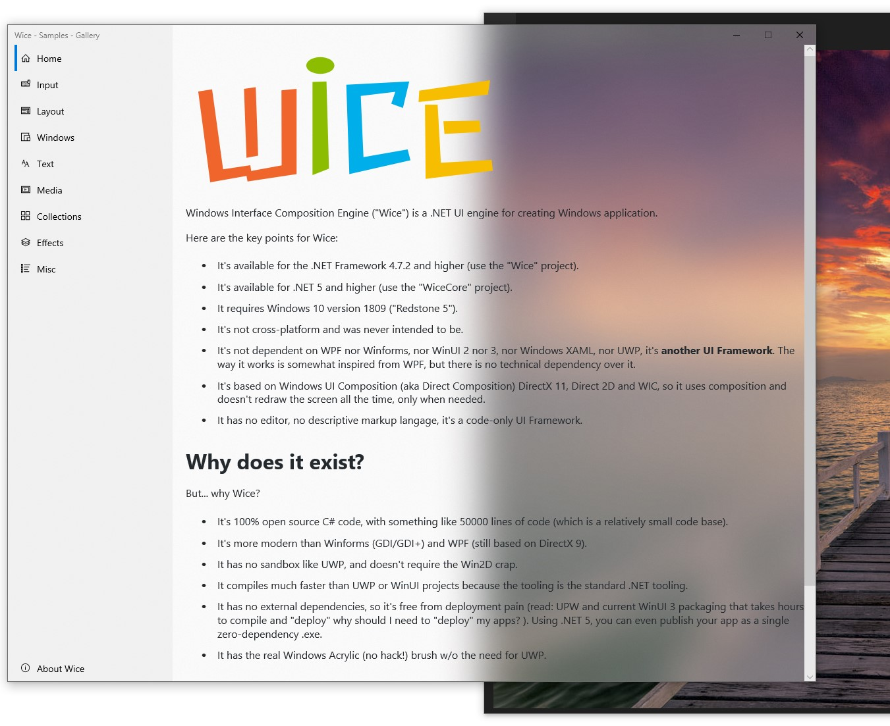
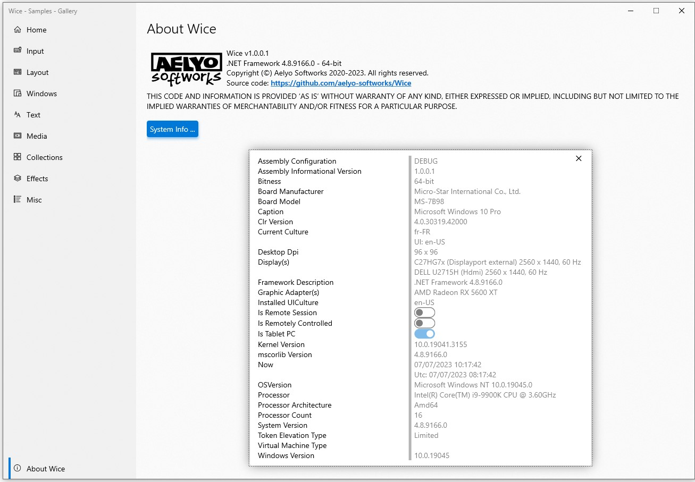
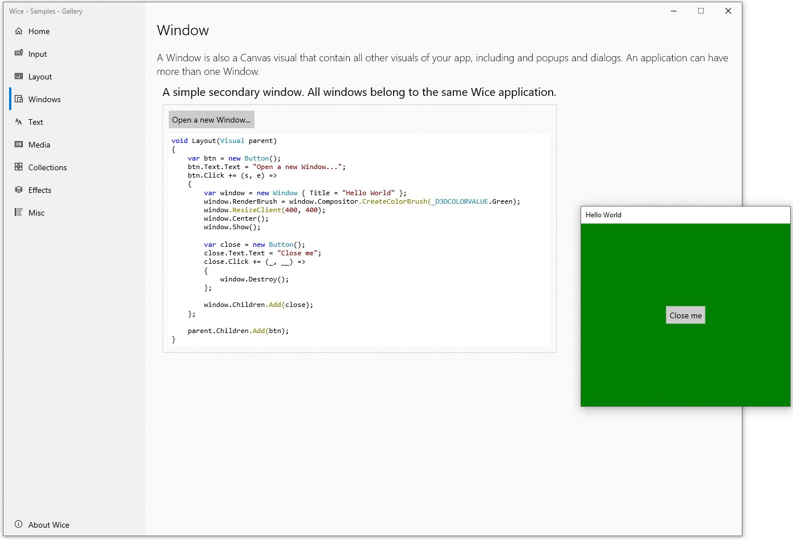
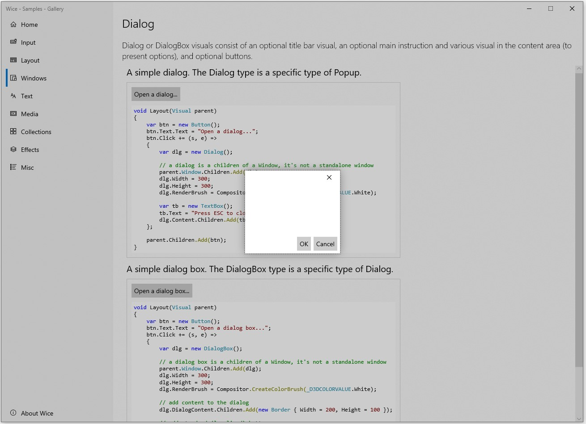
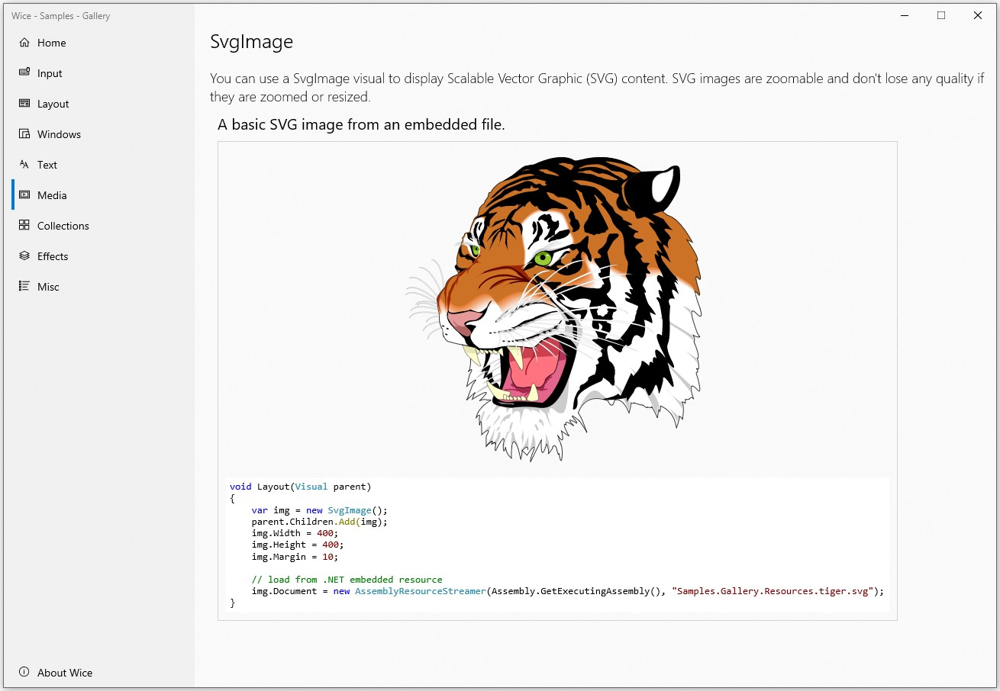
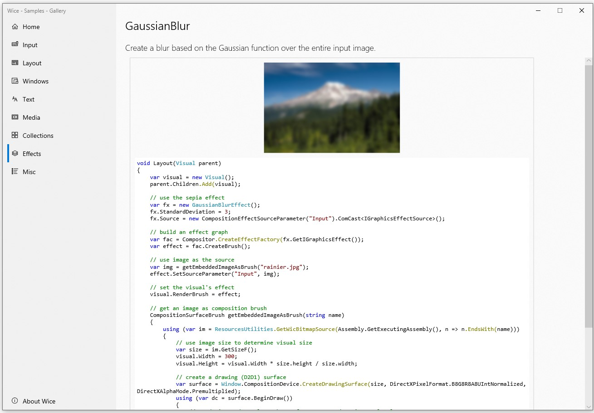
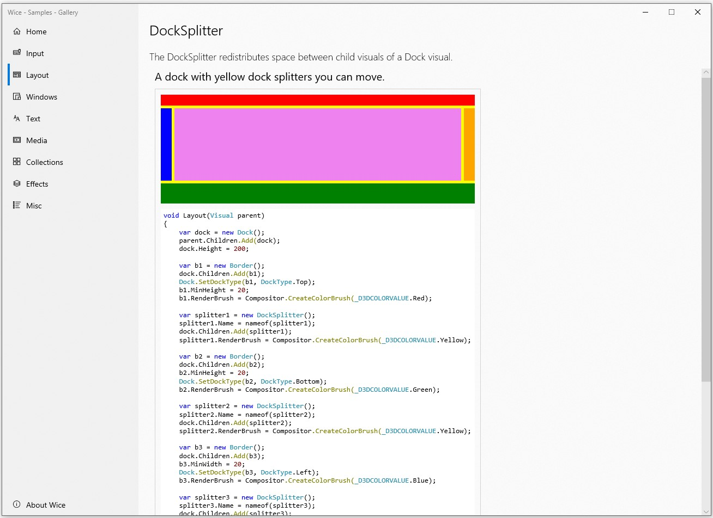
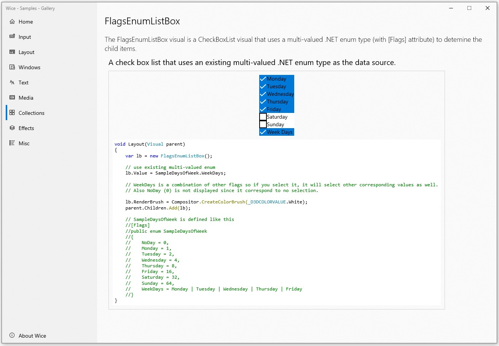
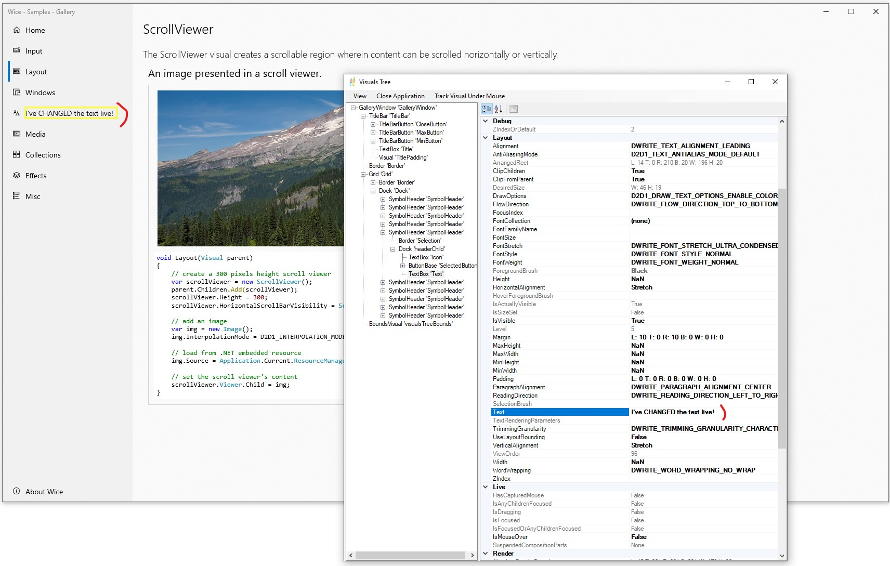

# What is it?

Windows Interface Composition Engine ("Wice") is a .NET UI engine for creating Windows application.

Here are the key points for Wice:

* It's available for the .NET Framework 4.7.2 and higher (use the "Wice" project).
* It's available for .NET 5/6/7+ (use the "WiceCore" project).
* It requires Windows 10 version 1809 ("Redstone 5").
* It's not cross-platform and was never intended to be.
* It's not dependent on WPF nor Winforms, nor WinUI 2 nor 3, nor Windows XAML, nor UWP, **it's another UI Framework**. The way it works is somewhat inspired from WPF, but there is no technical dependency over it.
* It's based on Windows UI Composition (aka Direct Composition) DirectX 11, Direct 2D and WIC, so it uses composition and doesn't redraw the screen all the time, only when needed. This part heavily uses interop code and is done using the **DirectN** open source package available here https://github.com/smourier/DirectN.
* It has no editor, no descriptive markup language, it's a code-only UI Framework.

# Why does it exist?
But... why Wice?

* It **still support .NET Framework 4.7.2**.
* It's **100% open source C# code**, with something like 50000 lines of code (which is a relatively small code base).
* It's more modern than Winforms (GDI/GDI+) and WPF (which is still based on DirectX 9 and that causes lots of issues).
* It has **no sandbox like UWP**, and **doesn't require Win2D**  (it's too complex to use and requires all sort off painful MSVC dependencies).
* It **compiles much faster than UWP or WinUI** projects because the tooling is the standard .NET "old" tooling we all love an cherish.
* It has no external dependencies, so it's **free from deployment pain** (read: UPW and current WinUI 3 packaging that takes hours to compile and "deploy" `<rant>` why should I need to "deploy" my apps at all?`</rant>`). Using .NET 5/6/7+, you can even publish your app as a *really single* zero-dependency .exe!
* It has the real Windows Acrylic (no hack!) brush w/o the need for UWP.
* It ships with an integrated in-process (Snoop-like for people familiar with WPF) visual "Spy" utility (just press F9 in debug mode, actually, this sole part uses Winforms, but it's not necessary for Wice, it's more like an external embedded tool).

# Status
Wice is still a work in progress. The base system is working quite well but it's not 100% finished.

Please post an issue if you have a problem or a question, using sample reproducible code.

# List of projects
.NET Standard & Framework projects:
* **Wice**: the Wice engine.
* **Wice.Samples.Gallery**: a sample demo / gallery project. **===>** This is what you should try if you're new to Wice.
* Wice.Tests: a test bench project. You shouldn't really use it
* Wice.DevTools: an internal tool that helps synchronize .NET 6 projects from .NET Framework projects.

.NET 6 projects:
* **WiceCore**: this is the same as Wice but compiled for .NET 6. All sources are linked to Wice.
* **WiceCore.Samples.Gallery**: this is the same as Wice.Samples.Gallery but compiled for .NET 6. All sources are linked to Wice.Samples.Gallery.
* WiceCore.Tests: this is the same as Wice.Tests but compiled for .NET 6 All sources are linked to Wice.Tests. 

✨ NEW 2024 / 09 ! ✨ .NET 8 AOT-friendly projects:
* **WiceAot**: this is the same as Wice but compiled for .NET 8, AOT friendly. Source has been adapted and project is using [DirectNAot](https://github.com/smourier/DirectNAot).
* WiceAot.Tests: this is simple sample code for WiceAot

# Screenshots

Here are some screenshots of the Samples Gallery app.

Wice has **acrylic brush** to integrate with background nicely, here over the **RTF Textbox** visual:

A useful and extensible **Property Grid** visual to easily create editor interfaces like settings, etc.:

You can build a **Multi-Windows** application:

You can show **Dialog Boxes**. They are part of the current window visual so can be clicked through and are centered automatically when the app is resized:

An **SVG image** visual:

You can add **Direct2D** effects on a visual:

A mouse-controlled **Dock Splitter** visual:

An automatic [Flags] enum to **Checkable List Box** visual, very useful when combined with the property grid:

And last but not least, the "snoop"-like feature (press F9 anytime when compiled in DEBUG), that shows all the details of the visuals tree and also allow you to modify values in real-time:

Note: that sole part uses Winforms (another framework to avoid chicken and egg effect!) but you can remove that piece of code if you don't need it.
