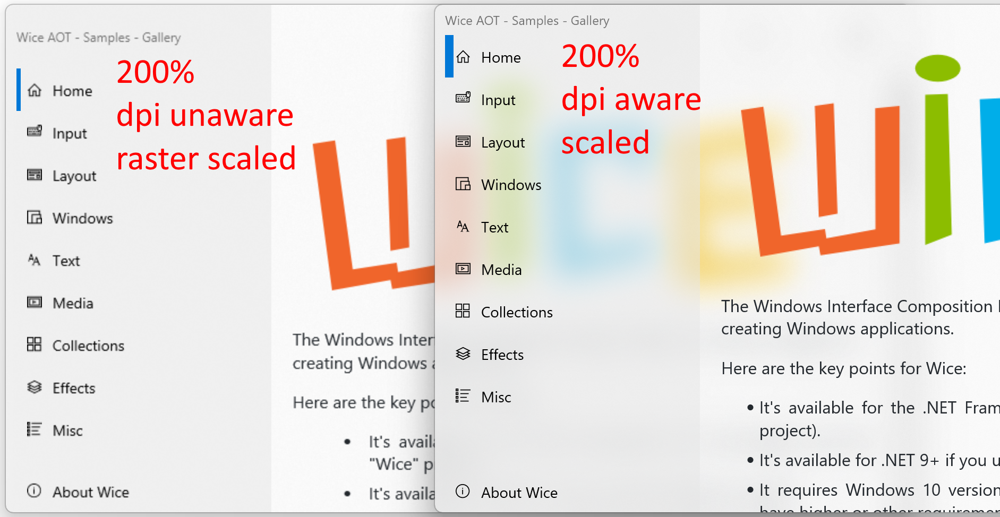

# What is it?

The Windows Interface Composition Engine ("Wice") is a .NET UI engine for creating Windows applications.

Here are the key points for Wice:

* It's available for the .NET Framework 4.7.2 and higher (use the "Wice" project).
* It's available for .NET 9+ if you use the "WiceAot" project.
* It requires Windows 10 version 1809 ("Redstone 5"). Some parts may have higher or other requirements.
* It's not cross-platform and was never intended to be.
* It's not dependent on WPF nor WinForms, nor WinUI 2 nor 3, nor Windows XAML, nor UWP, **it's another UI Framework**. The way it works is somewhat inspired by WPF, but there is no technical dependency over it.
* It's based on Windows UI Composition (aka Direct Composition) DirectX 11, Direct 2D and WIC, so it uses composition and doesn't redraw the screen all the time, only when needed. This part heavily uses interop code and is done using the **DirectN** open-source package available here https://github.com/smourier/DirectN or the **DirectNAot** package available here https://github.com/smourier/DirectNAot
* It has no graphical editor, no descriptive markup language, it's a code-only UI Framework.

# Why does it exist?
But... why Wice?

* It **still supports .NET Framework 4.7.2**.
* It's **native AOT deployment compatible**, unlike most .NET UI frameworks.
* It's **100% open source C# code**, with something like 50000 lines of code (which is a relatively small code base).
* It's more modern than Winforms (GDI/GDI+) and WPF (which is still based on DirectX 9 and that causes lots of issues).
* It has **no sandbox like UWP** and **doesn't require Win2D** (it's too complex to use and requires all sort of painful MSVC dependencies).
* It **compiles much faster than UWP or WinUI3** projects because the tooling is the "standard" .NET tooling we all love and cherish.
* It has no external dependencies, so it's **free from deployment pain** (read: UPW and current WinUI 3 packaging that takes hours to compile and "deploy" `<rant>` why should I need to "deploy" my apps at all?`</rant>`). Using .NET 5/6/7/8/9+, you can even publish your app as a *really single* zero-dependency .exe, and if you use WiceAOT and .NET 9 it's even better. Check out the **Samples Gallery** sample in the [Releases](https://github.com/aelyo-softworks/Wice/releases) section, it's just one .exe!
* It has Windows Acrylic (no hack!) brush w/o the need for UWP or WinAppSDK.
* Unless you use WiceAOT, Wice ships with an integrated in-process (Snoop-like for people familiar with WPF) visual "Spy" utility (just press F9 in debug mode, actually, this sole part uses Winforms, but it's not necessary for Wice, it's more like an external embedded tool).

# Status
Wice is always a work in progress. Please post an issue if you have a problem or a question, using sample reproducible code.

# .NET Framework 4.7.2+
* **Wice**: the Wice engine.
* **Wice.Samples.Gallery**: a sample demo / gallery project. **===>** This is what you should try if you're new to Wice.
* Wice.Tests: a test bench project. You shouldn't really use it.
* Wice.DevTools: an internal tool that helps synchronize .NET 6 projects from .NET Framework projects.

# .NET 9+ AOT-compatible:
* **WiceAot**: this is the same as Wice but compiled for .NET 9, AOT friendly. Source has been adapted and project is using [DirectNAot](https://github.com/smourier/DirectNAot).
* **WiceAot.Samples.Gallery**: a sample demo / gallery project. **===>** This is what you should try if you're new to Wice.
* WiceAot.Tests: this is simple sample code for WiceAot. You shouldn't really use it.

# Screenshots

Here are some screenshots of the Samples Gallery app.

Wice has **acrylic brush** to integrate with background nicely, here over the **RTF Textbox** visual:

A useful and extensible **Property Grid** visual to easily create editor interfaces like settings, etc.:

You can build a **Multi-Windows** application:

You can show **Dialog Boxes**. They are part of the current window visual so can be clicked through and are centered automatically when the app is resized:

An **SVG image** visual:

You can add **Direct2D** effects on a visual:

A mouse-controlled **Dock Splitter** visual:

An automatic [Flags] enum to **Checkable List Box** visual, very useful when combined with the property grid:

A textbox displaying **advanced Direct Write** stylistic feature set with Gabriola font, over a beautiful acrylic background:

A **WebView2** visual (WiceAOT only):

A **Pdf** visual

# Hi-DPI support
Wice now supports hi-dpi scaling. It's not 100% automatic, your code may have to react to dpi changes, but everything is prepared.

Note: *RichTextBox* hi-dpi scaling doesn't work with Wice .NET Framework, only with Wice AOT.

# Debugging
And last but not least, the "snoop"-like feature (press F9 anytime when compiled in DEBUG), that shows all the details of the visuals tree and also allow you to modify values in real-time:

Note: that sole part uses Winforms (another framework to avoid chicken and egg effect!) but you can remove that piece of code if you don't need it. It's not currently available in Wice AOT.
